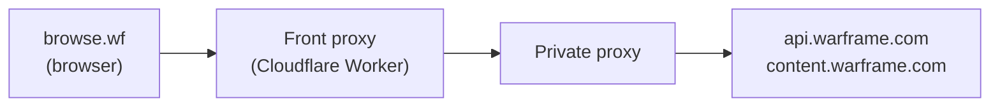

# browse.wf

A search engine for Warframe game data, allowing users to browse and search through space ninja information.

This is a fork of Sainan-senpai's [calamity-inc/browse.wf](https://github.com/calamity-inc/browse.wf).

## Fork features and changes

### For Warframe players

- **Cloud sync**: Discord authentication with a database backend for backing up preferences and syncing across devices
- **Custom Arby's timers**: Set custom countdown timers on the arbitration schedule page
- **Navbar customization**: Optional setting to unfix the navbar

#### Live page

- **Widget filters**: Configurable filter panels to selectively display content; for example:
  - News: Filters for red text, community events, and regular events
  - Bounties: Filter by tier for each syndicate
  - Steel Path incursions: Filter by mission type
  - Void fissures: Filter by tier/era and mission type
  - Weekly missions: Filter by Archon Hunt, Ayatan Hunt, Elite Archimedia, and Netracells
  - Invasions: Option to hide randomized mission types
- **Improved void fissures UI**: Enhanced layout, sorted by expiry for each relic tier/era
- **Enhanced invasion info**: Populated with and sorted by progress data
- **Sortie locations**: Mission locations now displayed in the Sortie card
- **Descendia card**: Experimental Descendia rotation display
- **Notification icons**: Bells now use a colour/fill pattern (coloured when enabled, grayscale when disabled) instead of bell/bell-slash icons, matching more modern UX patterns.
- **Cross-platform UI**: System-independent checkbox styling

#### Other pages

- **Profile viewer**:
  - Guided workflow with step-by-step instructions for retrieving profile data
  - Account ID extraction from EE.log file
  - Sortable tables on stats tab
  - Mission completion percentages displayed alongside absolute counts
  - Increased precision for cipher completion times
- **Invigorations**: Response caching so that info is preserved on refresh and next week

### For developers

- **GitHub Pages deployment**: Automated workflow for deploying static builds to GitHub Pages
- **Automated testing**: Vitest and Playwright test infrastructure (mainly for the `/live` page so far)

## Tech Stack

- **Backend**: PHP
- **Frontend**: TypeScript, Bootstrap
- **Dev Server**: Vite (serves pre-rendered PHP pages with hot reload)
- **Build**: TypeScript compiler, PHP renderer
- **Testing**: Vitest + jsdom (unit), Playwright (E2E)
- **Dependencies**:
  - Bootstrap (CSS framework)
  - Showdown (Markdown parser)
  - warframe-public-export-plus (Warframe game data)

## Prerequisites

Before running this application locally, ensure you have the following installed:

- [PHP](https://www.php.net/downloads)
- [Node.js](https://nodejs.org/) (includes npm)

## Installation

1. Clone the fork:
   ```bash
   git clone https://github.com/dsinn/browse.wf.git
   cd browse.wf
   ```

2. Install npm dependencies:
   ```bash
   npm install
   ```

## Running the Application

1. Start the development server:
   ```bash
   npm run dev
   ```

   Or with a custom port:
   ```bash
   PORT=8080 npm run dev
   ```

   This runs three processes concurrently:
   - **TypeScript compiler** (`tsc --watch`): Compiles `.ts` files to `typestripped/`
   - **PHP renderer** (`scripts/render-pages.js --watch`): Renders PHP pages to static HTML in `public/`, re-renders when `.php` files change
   - **Vite dev server**: Serves the site with hot reload for PHP, TypeScript, and CSS changes

2. Open your browser and navigate to http://127.0.0.1:60969 (or your custom port)

3. The application should display with the message: "It's like a search engine, but for space ninjas."

## Development

- TypeScript source files (`.ts`) are compiled to JavaScript in the `typestripped/` directory
- PHP files are rendered to static HTML in `public/` and served by Vite
- The dev server watches for changes to `.php`, `.ts`, and `.css` files and auto-reloads the browser
- Changes to test files, config files, and documentation do not trigger reloads
- The app uses Bootstrap's dark theme by default
- The server runs on a fixed port (60969) to preserve localStorage data across restarts
- localStorage is used to store user inventory, notification preferences, and language settings

### Testing

The project uses two types of automated tests:

```bash
npm test              # Run unit tests (Vitest)
npm run test:e2e      # Run E2E tests (Playwright)
```

For more commands, debugging options, and testing strategies, see [test/README.md](test/README.md).

### Warframe API Proxy (Optional)

The Warframe API (`api.warframe.com`) does not send CORS headers, preventing direct browser fetches. The API's WAF also returns 403 for all requests originating from Cloudflare Worker egress IPs. This fork uses a two-hop proxy to work around both issues:



| Component | Responsibilities |
|---|---|
| **browse.wf** | Initiates API requests; supplies auth token |
| **Front proxy** | Enforces CORS, validates the auth token, validates and routes requests to the private proxy |
| **Private proxy** | Forwards requests to the Warframe API via plain HTTP fetch from a non-Cloudflare IP |
| **Warframe API** | Source of world state and player profile data |

See [warframe-api-front-proxy](https://github.com/dsinn/warframe-api-front-proxy) for the Worker and its private proxy interface specification. An example private proxy implementation is available [here](https://gist.github.com/dsinn/1fe1847b696952bfc4884a0a35afa5f5).

<details>
<summary>Abridged Architecture Decision Record</summary>

**Context**

The Warframe API (`api.warframe.com`) does not send CORS headers, preventing browser-based apps from fetching it directly. A server-side proxy is the standard solution, but the API's WAF (Akamai) returns 403 for all requests originating from Cloudflare Worker egress IPs, regardless of request headers.

**Options considered**

- **Direct browser fetch** — blocked by missing CORS headers
- **Single serverless proxy** — blocked by Cloudflare egress IPs being rejected by the WAF
- **GitHub Actions scheduled job** — would require regular workflow runs to keep a cached copy fresh; rejected as operationally fragile
- **Two-hop proxy via shared hosting** — shared hosting providers make plain HTTP requests from a non-Cloudflare IP; a Cloudflare Worker can act as the public-facing layer while delegating the actual fetch to the shared host

**Decision**

Use a two-hop architecture. The two components are named by their role in the chain:

- **Front proxy** — the public-facing Cloudflare Worker; because its URL is public, it enforces CORS, token authentication, input validation, and strict route-to-upstream mappings
- **Private proxy** — its URL is kept secret and known only to the front proxy; intentionally kept as simple as possible (accept a `?url=` parameter, fetch it, return the response) so that the contract is easy to implement in whatever language the host provider supports

**Consequences**

- The Warframe API receives requests from a non-Cloudflare IP, bypassing the WAF block ✓
- CORS and auth are handled at the Cloudflare edge, not on shared hosting ✓
- The private proxy URL is kept secret; only the front proxy URL is exposed to clients ✓
- Requires maintaining two deployed services instead of one ✗
- Depends on shared hosting remaining available and on a non-blocked IP range ✗

</details>

The app defaults to using the front proxy at `https://warframe-api-front-proxy.dsinn69.workers.dev`. To use it, add the token to your `.env`:

```
WARFRAME_API_FRONT_PROXY_TOKEN=<value of X-Warframe-API-Front-Proxy-Token from browser dev tools>
```

To use a different front proxy, also set:

```
WARFRAME_API_FRONT_PROXY_BASE_URL=https://your-worker.workers.dev
```

> **Note for downstream forks:** The front proxy validates `ALLOWED_HOST`, so the default front proxy will reject requests from your fork's domain. You must deploy your own front proxy and private proxy — see [warframe-api-front-proxy](https://github.com/dsinn/warframe-api-front-proxy) and [warframe-api-private-proxy-php](https://github.com/dsinn/warframe-api-private-proxy-php).

### Cloud Sync (Optional)

This app stores all preferences locally in your browser by default. Cloud sync uses Discord for authentication, and the instructions below are tailored for Supabase as the storage backend.

If you want to enable cloud sync to backup preferences and sync across devices:

1. **Create a database project** at https://supabase.com
   - Get your Project URL and anon key from Project Settings → API
   - Expose the "public" schema in Settings → API → "Extra exposed schemas" (add `public` to the list)
   - Run `cloud-sync-schema.sql` in the SQL Editor to create the database schema
   - Enable Realtime for the `user_data` table in Database → Replication (for instant cross-device sync)
   - Configure redirect URLs in Authentication → URL Configuration:
     - Set **Site URL** to your production URL (e.g., `https://dsinn.github.io`)
     - Add **Redirect URLs**: `https://dsinn.github.io/browse.wf/**` for production, `http://127.0.0.1:60969/**` for local dev
   - Optional: Disable the email provider in Authentication → Providers (security best practice since we only use Discord)
   - Optional: Lower JWT expiry in Authentication → Settings to reduce the risk window during OAuth sign-in (tokens briefly appear in the browser's URL bar before automatic cleanup; shorter expiry limits how long captured tokens remain valid without affecting session length)

2. **Set up Discord OAuth** at https://discord.com/developers/applications
   - Create a new application
   - Add your Supabase callback URL to OAuth2 redirects
   - Connect Discord to Supabase in Authentication → Providers

3. **Configure environment variables**:
   - Copy `.env.example` to `.env`
   - Add your Supabase credentials
   - For deployment, add them to GitHub Secrets

For detailed setup instructions, see:
- [Supabase Auth with Discord](https://supabase.com/docs/guides/auth/social-login/auth-discord)
- [Discord OAuth2 Documentation](https://discord.com/developers/docs/topics/oauth2)

**Privacy:** Discord OAuth authentication stores your Discord username, email address, app preferences, and form data in Supabase. This data is only accessible to you and the site owner, protected by Supabase's authentication system.

## Project Structure

- `*.php` - PHP page templates
- `*.ts` - TypeScript source files
- `components/` - Reusable PHP components (navbar, common JS includes)
- `helpers/` - Shared build utilities (PHP server, PHP renderer)
- `public/` - Pre-rendered HTML for Vite dev server (generated, do not edit)
- `scripts/` - Dev and build scripts (PHP page renderer)
- `supplemental-data/` - Additional game data and utilities
- `typestripped/` - Compiled JavaScript output (generated, do not edit)

## Available Scripts

- `npm run dev` - Start development server with TypeScript watch mode
- `npm run lint` - Run ESLint on TypeScript files
- `npm test` - Run unit tests (Vitest)
- `npm run test:e2e` - Run E2E tests (Playwright)
- `npm run build` - Build static site for GitHub Pages deployment

See [test/README.md](test/README.md) for additional test commands.

## Deployment

This fork can be deployed to GitHub Pages using the included workflow.

### Manual Deployment

1. Build the static site locally:
   ```bash
   npm run build
   ```
   This compiles TypeScript, renders all PHP files to HTML, and prepares assets in the `dist/` directory.

2. The build script automatically:
   - Compiles TypeScript to JavaScript (`typestripped/`)
   - Renders all PHP files to static HTML
   - Rewrites paths for the `/browse.wf/` base path
   - Copies all necessary assets (JS, data files, etc.)

### GitHub Actions Deployment

Deploy to GitHub Pages via GitHub Actions:

1. Go to your repository's **Actions** tab
2. Select **Deploy to GitHub Pages** workflow
3. Click **Run workflow**
4. Site will be available at: `https://<username>.github.io/browse.wf/`

The workflow is manually triggered only. It builds the site and pushes to the `gh-pages` branch.

## Notes

- The development server runs on port 60969 by default (configurable via `PORT` environment variable)
- Using a fixed port ensures localStorage data (inventory, preferences) persists across server restarts
- TypeScript compilation happens automatically in watch mode; source maps are generated for debugging
- PHP pages are auto-discovered (any `.php` file in the root, excluding partials and config files)

## Example Git Hooks

These mirror the checks that run in CI.

### `.git/hooks/pre-commit`

```shell
#!/bin/bash
set -e

echo "Running pre-commit checks..."

echo "→ Linting TypeScript files..."
npm run lint

echo "→ Type checking..."
npm exec tsc

echo "✓ Pre-commit checks passed"
```

### `.git/hooks/pre-push`

```shell
#!/bin/bash
set -e

echo "Running pre-push checks..."

echo "→ Running tests..."
npm test -- --run --reporter=dot --silent

echo "→ Testing build..."
npm run build

echo "✓ Pre-push checks passed"
```
