# Cloud Sync Architecture

**Last updated:** 2026-04-09

## Overview

The cloud sync system synchronises a user's browser `localStorage` state to a Supabase
PostgreSQL database, enabling settings and completion state to persist across devices and
browser sessions. It is triggered by user actions (filter changes, checkbox toggles) and
propagated in real time to other open tabs and devices via a Supabase WebSocket channel.

The system is opt-in and requires Discord authentication. Pages that do not import
`auth-init.ts` are unaffected.

---

## Module Map

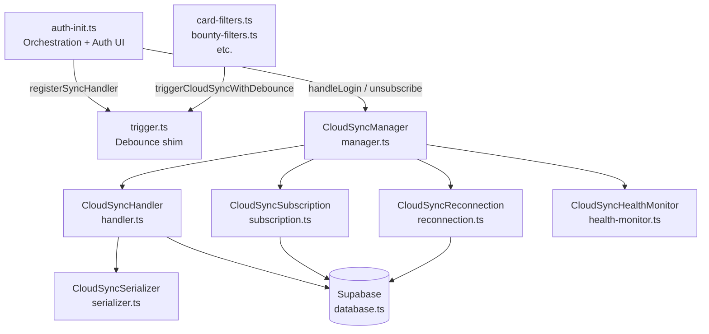

`trigger.ts` has no imports — the arrow from `auth-init.ts` represents handler registration
at startup, not an import dependency. At runtime, `trigger.ts` invokes the registered handler
(owned by `auth-init.ts`) when a sync is requested.

**Dependency rules:**
- `trigger.ts` has no imports from the sync stack — it is a zero-dependency shim.
- `CloudSyncSerializer` is pure: no network calls, no singletons.
- `CloudSyncHandler`, `CloudSyncSubscription`, `CloudSyncReconnection`, and
  `CloudSyncHealthMonitor` receive all cross-service dependencies via injected callbacks,
  avoiding circular imports.
- `CloudSyncManager` is the only class that holds references to all four services.

---

## Module Responsibilities

### `trigger.ts` — Debounce shim

The only module that feature code (`card-filters.ts`, etc.) imports directly. Exposes three
functions globally so non-module scripts can call them without ES6 imports:

| Function | Behaviour |
|---|---|
| `triggerCloudSync()` | Immediate push, no debounce |
| `triggerCloudSyncWithDebounce()` | Schedules a push 5 s in the future; resets timer on each call |
| `flushDebounce()` | Cancels the timer and pushes immediately (used on `beforeunload`) |

`auth-init.ts` calls `registerSyncHandler()` once during page load to wire the real push
implementation. Before that point all calls are silent no-ops.

---

### `CloudSyncSerializer` — Pure data transform

Converts between the flat `localStorage` key space (`"live.filter.news.danger"`) and the nested
object stored in the database (`{live: {filter: {news: {danger: "0"}}}}`).

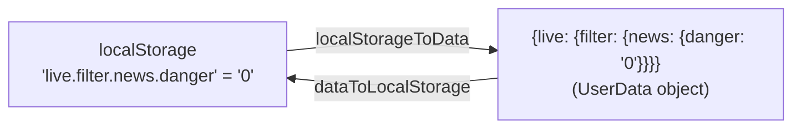

Keys matching `localOnlyKeyRegex` are excluded from serialisation — they are device-local and
must not be synced. The regex is a prefix match covering two families:

| Prefix | Keys excluded | Reason |
|---|---|---|
| `sb-*-auth-token` | Supabase session token | Sensitive credential |
| `profile.data` | `profile.data`, `profile.dataFetchedAt` | Large cache + companion timestamp; device-specific |

The prefix match for `profile.data` intentionally covers both the cache key and its timestamp
companion, so adding further `profile.data*` keys in future does not require updating the regex.

Values are stored verbatim (no type coercion). This preserves upstream code contracts:
e.g. collapse state is stored as the string `"1"`, not the boolean `true`.

---

### `CloudSyncHandler` — Push / pull + deduplication

Owns the two database operations and the `justPushed` flag that prevents the realtime
subscription from reacting to changes the local tab itself pushed.

**Push flow:**

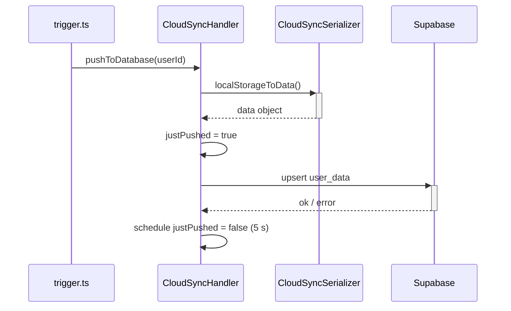

If the upsert fails, `justPushed` is cleared immediately and the error is re-thrown to the
caller.

**Pull flow:**

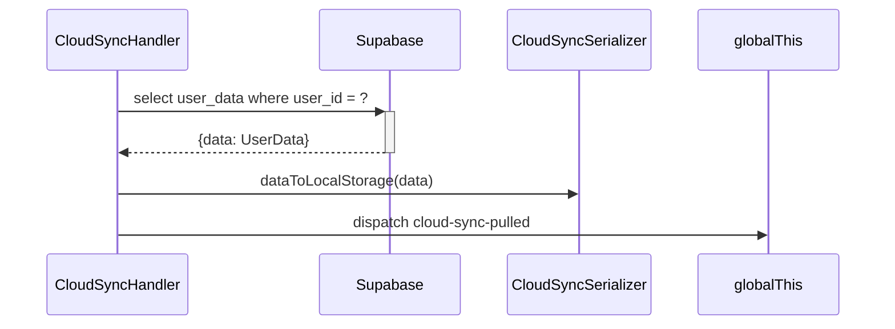

`cloud-sync-pulled` is consumed by `live/sync.ts` to refresh visible state (completion
toggles, collapse indicators, notification badges).

---

### `CloudSyncSubscription` — WebSocket lifecycle

Manages a single Supabase channel (`user_data:<userId>`) that receives `UPDATE` events when any
device pushes new data.

> **Browser warning — Cloudflare `__cf_bm` cookie:** The browser may log a warning about this
> cookie being rejected when the WebSocket connects. This is harmless — the browser is enforcing
> cookie security policies on Supabase's Cloudflare bot-management cookie. It cannot be
> suppressed from application code.

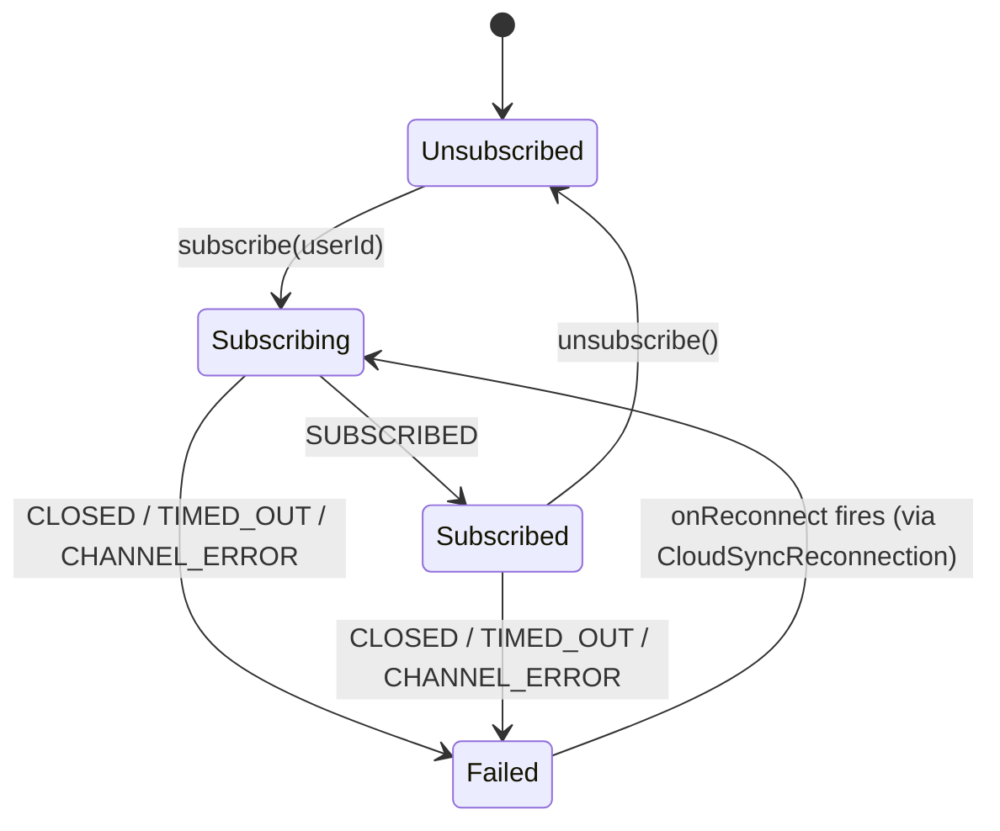

On `SUBSCRIBED`, the class calls the injected `onSubscribed(isResubscribe)` callback.
`isResubscribe` is `false` on the first-ever subscription, `true` on all subsequent ones
(including reconnects). `CloudSyncManager` uses this flag to decide whether to pull.

On a failed status, the `onFailedStatus` callback fires — wired to
`CloudSyncReconnection.attemptReconnect()`.

When an `UPDATE` arrives and `CloudSyncHandler.isJustPushed` is false, a pull is triggered.
Self-updates (from the same tab) are silently dropped via the `justPushed` flag.

---

### `CloudSyncReconnection` — Exponential backoff state machine

Schedules reconnection attempts with exponential backoff after WebSocket failures.

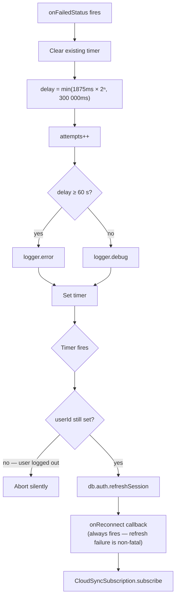

The backoff sequence: 1.875 s → 3.75 s → 7.5 s → 15 s → 30 s → 60 s → 120 s → 240 s →
300 s (cap), then 300 s indefinitely. There is no maximum attempt count.

The user ID is read lazily when the timer fires (not when `attemptReconnect()` is called), so
a logout that occurs during the wait window is respected.

`reset()` clears the attempt counter and cancels the pending timer (called on `SUBSCRIBED`).
`clearAll()` additionally clears `lastFreshTimestamp` (called on logout/unsubscribe).

---

### `CloudSyncHealthMonitor` — Heartbeat and visibility fallback

Tracks connection health independently of the WebSocket status events, providing a
time-based safety net for the reconnect-pull decision.

**Heartbeat** (every 5 s):

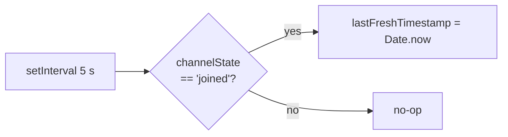

**Visibility fallback** (on `visibilitychange`):

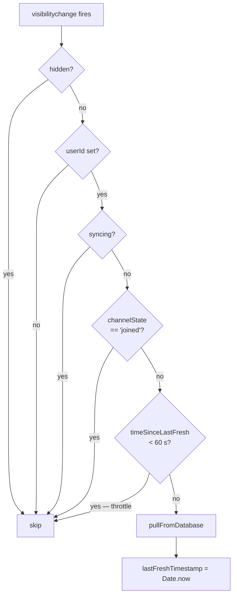

The visibility fallback handles the case where the WebSocket reconnection fails entirely (e.g.
extended offline period). When the user returns to the tab, they get a HTTP pull even if the
WebSocket is still down, so completion checkboxes and filter states are up to date.

---

### `CloudSyncManager` — Facade and coordinator

The public surface for all cloud sync operations. Holds one instance of each service and
wires them together via callbacks.

```mermaid
sequenceDiagram
    participant A as auth-init.ts
    participant S as CloudSyncManager
    participant H as CloudSyncHandler
    participant R as CloudSyncSubscription
    participant M as CloudSyncReconnection
    participant C as CloudSyncHealthMonitor
    participant DB as Supabase

    Note over A,DB: Page load (isDatabaseConfigured = true)
    S->>C: startHeartbeat(getChannelState, setTs)
    S->>C: startVisibilityFallback({...callbacks})

    Note over A,H: User logs in
    A->>S: handleLogin()
    S->>+DB: select user_data (probe)
    DB-->>-S: row exists?
    alt first login — no remote row
        S->>H: pushToDatabase(userId)
        H->>DB: upsert user_data (local → cloud)
    else returning user — remote row exists
        S->>H: pullFromDatabase(userId)
        H->>DB: select user_data (cloud → local)
    end
    S->>R: subscribe(userId)
    S->>globalThis: dispatch cloud-sync-complete

    Note over R,M: WebSocket fails
    R->>S: onFailedStatus()
    S->>M: attemptReconnect()
    M-->>R: onReconnect(userId) [after delay]

    Note over R,S: WebSocket reconnects
    R->>S: onSubscribed(isResubscribe=true)
    S->>M: reset()
    alt lastFreshTimestamp recent (≤ 10 s)
        S->>S: skip pull
    else stale or never connected
        S->>H: pullFromDatabase(userId)
    end

    Note over A,S: User logs out
    A->>S: unsubscribeFromRealtimeUpdates()
    S->>M: clearAll()
    S->>R: unsubscribe()
```

---

## Data Flow: Local Change to Cloud

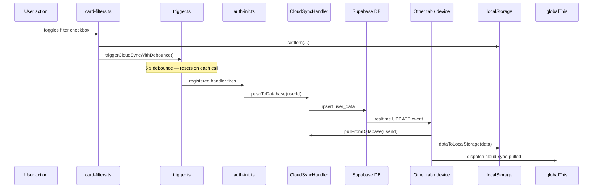

---

## Login Sync Decision

On login, the cloud is the authoritative source of truth:

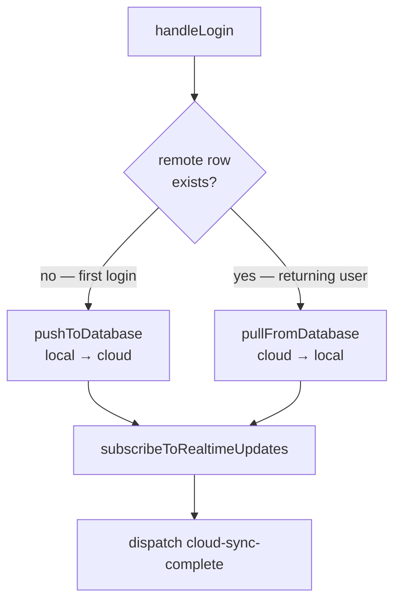

The cloud row is the authoritative source of truth for returning users. The only edge case is
a *first* login: if Device A has never synced and Device B has already created the remote row,
Device A's local-only data is overwritten when it logs in and pulls. The proper solution
(incremental per-key sync) is future work.

---

## Reconnection + Pull Decision on SUBSCRIBED

When the WebSocket reconnects, pulling is not always necessary:

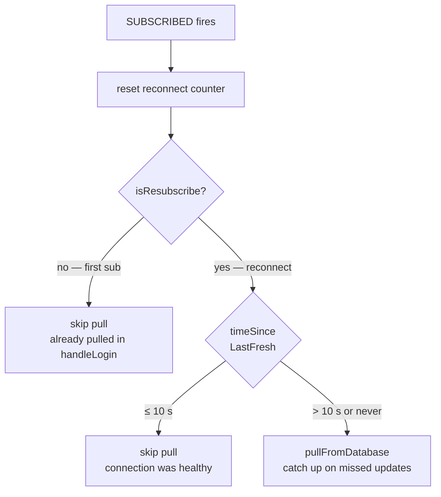

The 10 s quick-reconnect threshold is intentionally greater than the 5 s heartbeat interval.
If a heartbeat fired within the last interval, the connection was healthy when it dropped and
no data was missed.

---

## Custom Events

| Event | Dispatched by | Consumed by |
|---|---|---|
| `cloud-sync-complete` | `CloudSyncManager.handleLogin` | `profile/workflow.ts` — advances workflow step |
| `cloud-sync-error` | `CloudSyncManager.handleLogin` | `profile/workflow.ts` — marks workflow step failed |
| `cloud-sync-pulled` | `CloudSyncHandler.pullFromDatabase` | `live/sync.ts` — calls refresh functions for toggles, collapse state, notifications |
| `cloud-sync-before-push` | `CloudSyncHandler.pushToDatabase` | `live/sync.ts` — prunes stale OIDs and news-read entries before data is serialised |
| `cloud-sync-unavailable` | `auth-init.ts` | `profile/workflow.ts` — marks cloud sync unavailable |
| `cloud-sync-unauthenticated` | `auth-init.ts` | `profile/workflow.ts` — marks user as not logged in |
| `auth-signed-in` | `AuthService` (on `SIGNED_IN` or `INITIAL_SESSION`) | `auth-init.ts` → triggers `handleLogin` |
| `auth-signed-out` | `AuthService` (on `SIGNED_OUT`) | `auth-init.ts` → flush debounce + unsubscribe |
| `auth-state-changed` | `AuthService` (on `SIGNED_OUT` only) | `auth-init.ts` → update auth UI |

---

## Key Design Decisions

**Callback injection over direct references.** `CloudSyncSubscription` and
`CloudSyncReconnection` receive all cross-service dependencies as constructor callbacks rather
than importing each other. This breaks the circular dependency
(`CloudSyncSubscription` → `CloudSyncReconnection` → `CloudSyncSubscription`) without an event
bus or a shared singleton registry.

**Lazy user ID resolution.** `CloudSyncReconnection` takes `getCurrentUserId: () => string |
undefined` rather than capturing the user ID at call time. A logout that occurs during the
backoff window is respected — the timer fires, reads `undefined`, and aborts silently.

**`reset()` vs `clearAll()` split.** `reset()` clears the attempt counter and pending timer
but preserves `lastFreshTimestamp`. This allows `onSubscribed` to read the timestamp *after*
calling reset (which it must, to decide whether to pull). `clearAll()` is only called on
logout, where the timestamp is no longer meaningful.

**5-second `justPushed` window.** After a local push, the WebSocket `UPDATE` event for that
same change typically arrives within 100–500 ms. The 5 s window provides a generous buffer
against slow Supabase delivery without risking a genuine remote update being dropped (remote
updates from other devices would arrive independently).

**Last write wins.** The upsert overwrites the entire `user_data` row. Merge logic (comparing
per-key timestamps across devices) was considered and rejected: it adds significant complexity
for an edge case (first login on a device that has never synced, while another device already
owns the remote row) that real-time sync makes rare in practice. The correct long-term solution
is an incremental per-key API.

